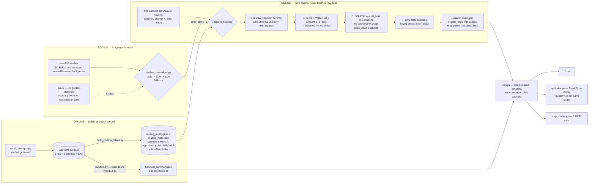

# Payment routing orchestrator

**Evidence in the hot path, AI at the edges.**

Given a card authorization about to be sent, it decides which payment service
provider should receive it — on empirical approval evidence, at a fee tolerance
the operator states in real units. If the attempt declines, a state machine
keyed on the decline's error class decides what happens next: same PSP later,
failover now, a different channel, or stop. The routing decision itself is
deterministic and auditable; no language model runs inside it.

Built by Bryan Rodríguez Abarca — a payments product manager who decides where
a model earns its place, and where it doesn't. More at
https://vryahn.com/work/routing

Built and shipped inside Claude Code: the engine, the AI edge layer, the eval
harness, the web UI, the API and this README were produced in agentic sessions
— one orchestrating session delegating to subagents (backend, UI, publish, case
study) — and are gated by the tests and evals you can run yourself. The
engineering discipline is the same one described in
[nutri.](https://vryahn.com/work/nutri): conventions the agent must load,
structural guardrails, and a machine — not a promise — as the definition of
done. The guardrails caught what would otherwise have shipped: a rewrite that
dropped every API path (found by post-deploy verification), a UI mislabeling
valid issuers as unseen, and two wrong assumptions of the author's (a
page-count rule, a DNS setup) that subagents refused to act on.

**Live demo** https://orchestrator.vryahn.com · **Case study**
https://vryahn.com/work/routing · **API** [`api/README.md`](api/README.md) ·
**MCP** [`MCP.md`](MCP.md)

Out-of-sample replay on 84,011 TEST transactions (days 22–31, tables trained on
days 1–21): expected approval **72.02%** at `cost_bias=0` against **66.13%**
actually observed — **+5.89 pp**, directional, not an A/B result. See
[Limitations](#limitations).

## Run it

Python 3.11. `requirements.txt` is the runtime — fastapi plus the standard
library, and the only thing Vercel installs. `requirements-dev.txt` adds the
offline stack (duckdb, pandas, numpy, pyarrow, mcp, uvicorn, httpx) needed to
regenerate data, run the backtest, serve MCP, or test locally.

```bash
python3.11 -m venv .venv && .venv/bin/pip install -r requirements-dev.txt
.venv/bin/python cli.py --txn-file demo_transactions.json   # 8 decision-boundary cases
.venv/bin/uvicorn api.index:app --reload --port 8000        # API on /api/*, UI from public/
```

The tables the engine reads (`routing_tables.json`, `routing_meta.json`) are
committed, so a fresh clone routes — and deploys — without the offline
pipeline. Regenerate them only if the data model changes:

```bash
.venv/bin/python synth_attempts.py         # seeded ~300k attempts -> attempts.parquet
.venv/bin/python build_routing_tables.py   # -> routing_tables.json, routing_meta.json
.venv/bin/python backtest.py --json        # -> backtest_summary.json
.venv/bin/python tests.py                  # engine
.venv/bin/python tests_ai.py               # AI edges + HTTP contract
.venv/bin/python evals/decline_eval.py     # normalizer against the golden set
```

## Architecture



## Why this design

- **Offline/online split.** `decide(txn, config) -> Decision` is pure. It loads
  pre-materialized tables once and never reads raw attempts, so the decision is
  microseconds, testable without a database, and auditable after the fact. It is
  the same boundary you would draw in production between a reconciliation layer
  and a routing layer.
- **Segment hierarchy with fallback.** L0 is `gateway_group × funding ×
  issuer_bucket × amount_band`; L3 is `gateway_group` alone. Support is resolved
  per PSP, one dimension at a time (amount band → issuer → funding), until a cell
  clears `min_support` (default 200), and the level used is reported with the
  decision. The channel is first-class and never dropped: user-present and
  off-session are different worlds.
- **Wilson lower bound, not the raw rate.** A segment with 3/3 approvals is not a
  100% segment. The bound shrinks toward zero as support thins, so a
  well-evidenced 78% beats a lucky 100% without a separate confidence rule
  bolted on.
- **`cost_bias` as an explicit knob, in real units.** The trade-off is stated as
  "percentage points of approval I will give up for a cheaper PSP" —
  `tolerance = cost_bias × 10pp`, and the cheapest PSP within that tolerance of
  the best approver wins. A blended score would let a fractions-of-a-point fee
  difference silently outvote a double-digit approval gap; a tolerance filter
  cannot. The backtest prices the knob: 72.02% / +5.89 pp approval at
  `cost_bias=0`, 71.56% / +5.43 pp at 0.5, 69.57% / +3.44 pp at 1.0.
- **Retry by error class, not by a blind counter.** `insufficient_funds` is an
  account problem and retries the same PSP on the next billing window;
  `bank_auth_required` off-session cannot be satisfied without the customer, so
  it reschedules to a user-present channel instead of burning attempts;
  `fraud_risk` stops the chain permanently; `generic_decline` fails over to the
  next PSP by score. An unrecognized class degrades to the generic failover
  policy and says so.

## Where AI belongs — and where it does not

**There is no LLM inside `decide()`.** Money should not move on a sampled token.
The language model is confined to the two edges where natural language actually
is the problem.

**In — `decline_normalizer.py`.** Each PSP declines in its own dialect: ISO 8583
numerics, a Stripe-like `decline_code`, an Adyen-like `refusalReason`, or raw
bank prose. The retry state machine keys on one enum, so the dialects have to
collapse before the engine sees them. A deterministic table handles the codes
that carry volume — confidence 1.0, no latency, no cost. Only a table miss
reaches the model chain (Gemini, then Mistral), which answers under a
constrained enum schema. Anything outside the enum, or below 0.6 confidence, is
discarded in favour of `generic_decline`, which is the retry policy's own safe
default. The repo runs green with no API keys set.

**Measured, not trusted — `evals/`.** 48 golden declines: ~60% table hits, ~40%
deliberately off-table (misspellings, verbose bank text, unusual codes) plus a
few genuinely ambiguous ones where `generic_decline` is the correct answer. The
`evals/baseline.json` records two baselines. Table-only (no keys): 32/48 =
**66.67%**, i.e. 100% on the 28 table-route cases and the safe `generic_decline`
default on the 20 that fall through. LLM (keys configured, run against the
deployed API with `--remote`): **48/48 = 100%** — 28 table, 19 answered by
`gemini-3.6-flash`, 1 by the low-confidence fallback where `generic_decline` was
the expected answer. The runner reports accuracy by route and a per-class
confusion table, asserts zero hallucinations, and fails the build if accuracy
drops more than 2 pp below the matching baseline.

**Out — `mcp_server.py`.** Six MCP tools — `route_transaction`,
`explain_decision`, `simulate`, `segment_evidence`, `normalize_decline`,
`backtest_summary` — let an agent operate the engine in English. The agent can
interrogate every decision and change none of them. See [`MCP.md`](MCP.md).

## Limitations

- Data is synthetic. The structure is designed to make routing decisions
  non-trivial, not to reproduce any real portfolio.
- No live PSP connectors: the engine decides, it does not send.
- No fraud scoring, 3DS orchestration, network tokens, or scheme retry-rule
  enforcement.
- The backtest is directional. Historical routing was not randomized, capacity
  limits are not modeled, and "expected approval" is a TRAIN-period Wilson-LB
  rate applied to TEST volume — not a live A/B result.
- Tables pool all attempts while the backtest trains and replays on first
  attempts only; first-attempt-only production tables would be the next fix.
- The LLM eval is 48 cases and one run; 100% on a golden set this small is a
  gate against regressions, not a claim about the long tail in production.

## File map

| file | purpose |
|---|---|
| `synth_attempts.py` | seeded generator for `attempts.parquet`; channel mix, PSP fees, approval model, error mix and retry behavior documented at the top |
| `build_routing_tables.py` | builds `routing_tables.json` (segment × PSP: n, approvals, `p_hat`, `wilson_lb`, all 4 levels) and `routing_meta.json` (amount-band edges, issuer whitelist, bin6 → issuer map, PSP fees, error-class enum) |
| `orchestrator.py` | the engine: `decide(txn, config) -> Decision`, `Config` dataclass. Stdlib only |
| `decline_normalizer.py` | PSP decline dialects → the engine's `error_class` enum: table first, LLM on a miss, safe fallback |
| `ops.py` | the operator functions (route, explain, simulate, evidence, normalize, backtest) shared by the API and MCP |
| `api/index.py` | FastAPI on Vercel; contract in `api/README.md` |
| `mcp_server.py` | MCP stdio server, six tools; see `MCP.md` |
| `cli.py` | CLI front end: one transaction via flags, or a batch via `--txn-file` |
| `public/` | static web UI, served by Vercel from the same origin as the API |
| `demo_transactions.json` | 8 decision-boundary transactions with `why_interesting` notes |
| `backtest.py` | TRAIN days 1–21 / TEST days 22–31 replay at `cost_bias` 0 / 0.5 / 1.0; `--json` rewrites `backtest_summary.json` |
| `evals/` | 48 golden declines, the scoring runner, and the recorded baseline |
| `tests.py` / `tests_ai.py` | assert-based checks: the engine, then the AI edges and the HTTP contract |

---

Bryan Rodríguez Abarca · [vryahn.com](https://vryahn.com) · Started from a
technical exercise, generalized as a personal project. Synthetic data.
